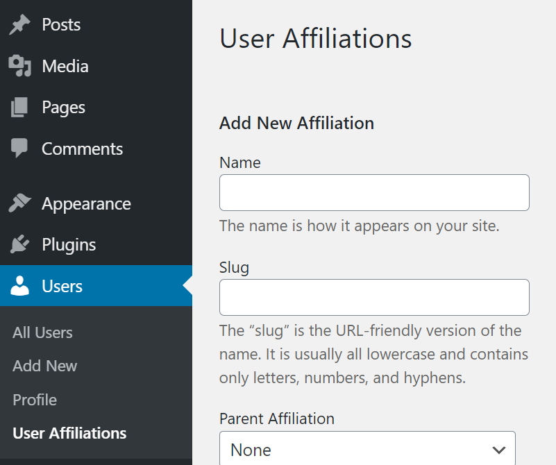
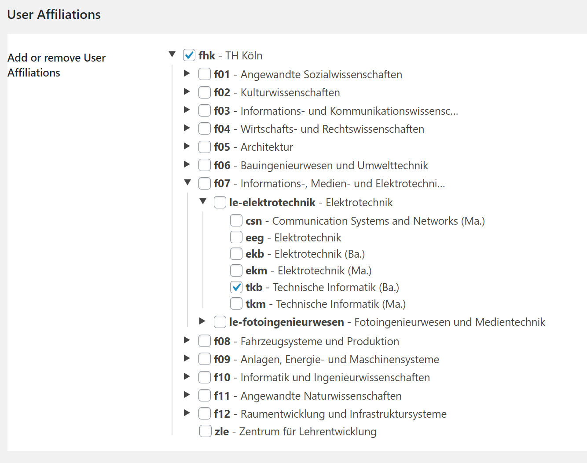

# Taxonomy Helper

WordPress allows you to add custom taxonomies (which are like categories). 
The design in quite flexible, and can not only be related to posts, but also to users.

❗ This is not yet stable, so be careful about using (dev-master).


This package adds some classes which help adding taxonomies.
- Simplify the creation of taxonomies: just specify ``singular_name`` and ``plural_name`` & see how far you get.
- Automatically adds the "edit-tags.php" - view to "Users"
  

- Automatically adds an UI to the profile (by default) if you add a user-taxonomy.<sup>[1](#fn-1)</sup>
  


## Example

```php
// works like register_taxonomy. It guesses all the other labels (in english).
$taxonomy = new Taxonomy_Helper(
	'post-affiliation',
	'post',
	array(
		'labels' => array(
			'singular_name' => esc_html( 'Affiliation', 'text_domain' ),
			'plural_name' => esc_html( 'Post Affiliations', 'text_domain' ),
		),
	),
);

// add a taxonomy to the user-object. It will automatically add interfaces to the backend to manage usercategories (wip).
$taxonomy = new User_Taxonomy_Helper(
	'user-affiliation',
	'user',
	array(
		'labels' => array(
			'singular_name' => esc_html( 'Affiliation', 'text_domain' ),
			'plural_name' => esc_html( 'User Affiliations', 'text_domain' ),
		),
		'capabilities' => array(
			'manage_terms' => 'edit_users', // Using 'edit_users' cap to keep this simple.
			'edit_terms'   => 'edit_users',
			'delete_terms' => 'edit_users',
			'assign_terms' => 'read',
		),
	)
);


```

## Todo
- Add a BlogTaxonomy
  - add backend UI.

## How do I query ...

The Table(s) ``wp(_XXX)_term_relationships`` have a column named ``object_id``. This is usually used to store ``post_id``s.
We use it in the following example for ``blog_id``s and ``user_id``s.


```php
$taxonomy_slug = 'affiliation'
/*
 * ... term taxonomies.
 * OR ... users/blogs by their IDs (object_ids)
 */
$terms_array = new WP_Term_Query(
	array(
		'taxonomy'               => $taxonomy_slug,
		'hide_empty'             => false,
		'object_ids'             => $object_ids, // don't need to specify.
	)
); // returns WP_Term[]|int List of terms, or number of terms when 'count' is passed as a query var.
$term_ids = wp_list_pluck( $terms_array, 'term_id' );

// ...users/blogs by terms
$object_ids = get_objects_in_term( $term_ids ); // WP_Tax_Query.

// ...terms by users/blogs
$terms = wp_get_object_terms( $object_ids, $taxonomies, $args = array() );

$args = array(
	'post_type' => 'album',
	'post_status' => 'publish',
	'tax_query' => array(
		array(
			'taxonomy' => 'genre',
			'field'    => 'slug',
			'terms'    => array( 'jazz', 'improv' )
		)
	)
);
// this probably doesn't work.
$query = new WP_Query( $args );

// The User Query
return $user_query->results;
new \WP_Site_Query()
```

### Users
```php
	$wp_users = new \WP_User_Query( array(
		'order'   => 'DESC',
		'orderby' => 'user_registered',
		'include' => $user_ids,
	)); // returns WP_User[] ?

```

### Blogs

## Notes
<a name="fn-1">1</a>: It will only be visible in the blog you created the taxonomy and if you have the set capability.
